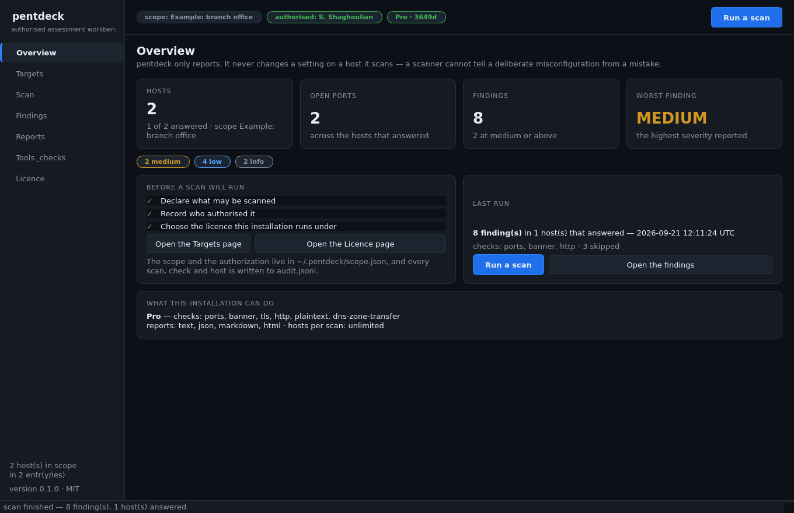
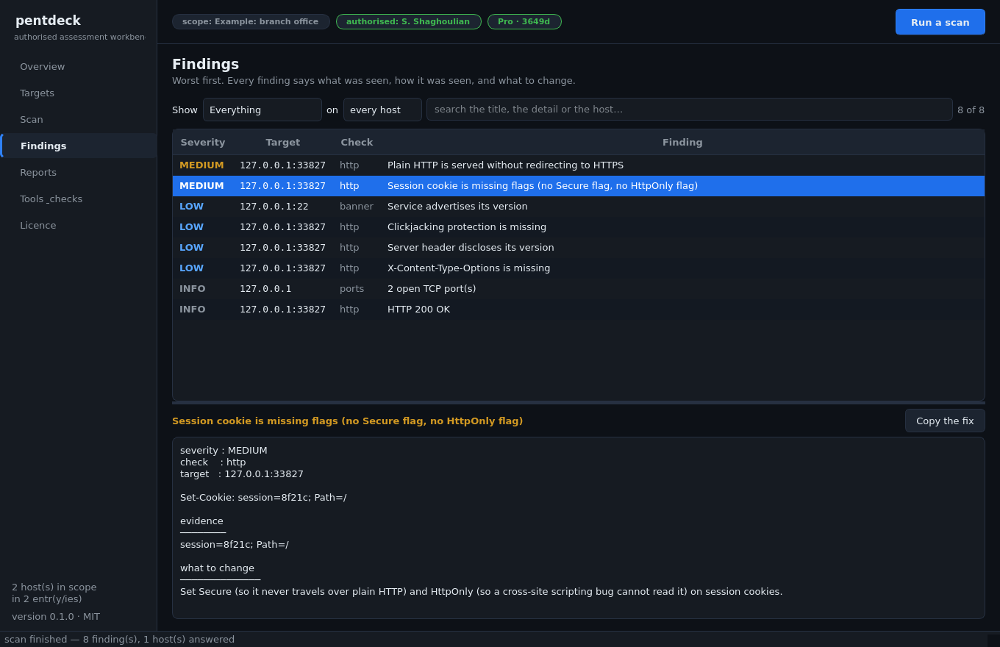
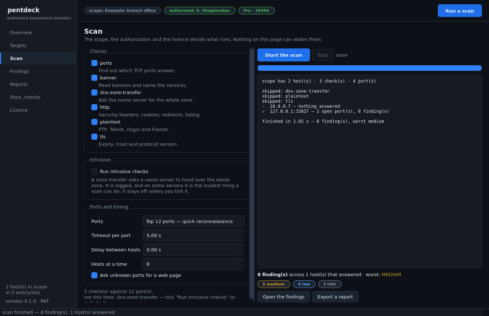

<div align="center">

# pentdeck

**A pentest workbench for authorised internal assessments.** Point it at the range
you were hired to test, and it reports what is exposed — with the evidence, the
severity, and the fix — as a document you can hand the client.

[](https://github.com/sasoun1366/pentdeck/actions/workflows/test.yml)
[](https://www.python.org/)
[](LICENSE)
[](pentdeck)
[](https://t.me/luyavaai)

</div>

> **This tool is for systems you own or have written permission to test.** pentdeck
> refuses to scan anything that is not in a declared scope, refuses to run without a
> recorded authorization, and writes an audit log of every action. Those three things
> are features, not paperwork: they are what keeps a pentest legal and what a client's
> legal team will ask you for.

## What it does

```console
$ pentdeck scope init --name "Acme HQ" --add 192.168.1.0/28
$ pentdeck authorize --operator "Your Name" --reference "contract 2026-114"
$ pentdeck scan --html report.html --md report.md
```

```
pentdeck 0.1.0 — internal network assessment

scope       : Acme HQ
authorized  : A. Tester — authority: contract 2026-114 (recorded 2026-09-21T11:29:49Z)
hosts       : 11 up of 14 in scope
checks      : ports, banner, http, plaintext, tls

findings    : 1 critical  ·  2 high  ·  4 medium  ·  6 low

CRITICAL 192.168.1.9:8443             TLS certificate expired 12 day(s) ago
         notAfter 2026-09-09 — subject CN=vpn.acme.local
         fix: Renew the certificate and add expiry monitoring so this cannot repeat silently.
```

| check | what it answers | included in |
| --- | --- | --- |
| `ports` | which TCP ports answer | Free, Pro, Team |
| `banner` | what service is behind them, and whether it advertises its version | Free, Pro, Team |
| `http` | security headers, cookie flags, missing HTTPS redirect, directory listing, version leaks | Pro, Team |
| `tls` | certificate expiry and trust, protocol version | Pro, Team |
| `plaintext` | FTP, Telnet, rlogin, rsh, VNC, unencrypted mail and SNMP | Pro, Team |
| `dns-zone-transfer` | whether a name server hands out the whole zone (`--intrusive`) | Pro, Team |

## The dashboard

The same engine, the same scope file, the same licence, the same audit log — with a
window instead of a terminal, for the days when you are standing in front of a client.

```bash
pip install -e ".[desktop]"     # PyQt6 is the only optional extra
pentdeck gui                    # or: pentdeck-desktop
```



Seven pages: **Overview** (what is declared, what was found), **Targets** (the scope, the
never-touch list, the authorization form, the audit trail), **Scan** (checks, port
profiles, timing, and a live log), **Findings** (filter, read the evidence, copy the fix),
**Reports** (text / Markdown / HTML / JSON), **Tools & checks** (what this licence may
run) and **Licence** (status, install a token, create an order).



The rules do not bend because there is a mouse involved: a scan started from the window
still refuses to run without a recorded authorization, still refuses hosts outside the
scope, and still stops at the free tier's 16 hosts — the refusal is shown in the window,
and the refusal itself is written to the audit log.



## What it deliberately does not do

- **No exploitation.** It reports exposure; it does not break in, does not brute-force
  credentials, and does not run anything that changes state on a target.
- **No automatic fixing.** A scanner cannot tell an intentional misconfiguration from a
  mistake, and changing a client's network during business hours ends the engagement.
  Every finding carries the remediation text instead.
- **No scanning outside the scope**, and no public addresses unless the scope says so
  in as many words.
- **No telemetry.** Nothing leaves the machine except the HTTP requests a scan makes
  to the targets you named.

## Install

```bash
git clone https://github.com/sasoun1366/pentdeck
cd pentdeck
python3 -m pentdeck --help          # no dependencies: nothing to install
```

or `pip install -e .` for the `pentdeck` command on your PATH. The dashboard is the only
thing that wants a dependency:

```bash
pip install -e ".[desktop]"     # adds `pentdeck gui` and `pentdeck-desktop`
```

## The three files in `~/.pentdeck`

| file | what it is |
| --- | --- |
| `scope.json` | targets, allow/deny rules, and the authorization record (mode 0600) |
| `audit.jsonl` | every scan, every check, every host, with timestamps |
| `license.json` | your licence token, if you have one |

## Licences

The free tier is a real tool — discovery, port scanning and service identification,
unlimited use, no time limit. Pro adds the configuration checks and the reports you
would otherwise write by hand.

| | Free | Pro | Team |
| --- | --- | --- | --- |
| hosts per scan | 16 | unlimited | unlimited |
| `ports`, `banner` | ✓ | ✓ | ✓ |
| `http`, `tls`, `plaintext`, `dns-zone-transfer` | — | ✓ | ✓ |
| HTML / Markdown / JSON reports | text only | ✓ | ✓ |
| price | $0 | **$99 once** | **$299 once** |

Buying is deliberately boring, and deliberately not automated:

```bash
pentdeck license request --name "Your Name" --email you@example.com --tier pro
# → an order code, the wallet address, and the amount
# → pay in USDT (TRC20) with the order code in the memo
# → the signed licence token comes back in the same chat
pentdeck license install PD1.…
```

### The vendor side of that flow

```bash
pentdeck license wallet T…      # store the address once, on the machine you sell from
pentdeck license issue --customer "Acme IT" --tier pro --days 365 --order PD-7K3Q
```

`license wallet` writes to `~/.pentdeck/wallet` (mode 0600) and is what every request,
every order and the dashboard's Licence page read. `PENTDECK_WALLET` still overrides it.
Amounts are never invented by the tool: the tier table decides the price, the order code
goes in the memo, and the token is issued by hand once the payment is confirmed.

Licences are signed tokens verified offline — no licence server, no phone-home, no
internet needed after installation. In fairness: an offline licence in a Python program
can be patched out by anyone determined, and this is not sold as DRM. It keeps honest
customers honest and makes paying the easy path.

## Roadmap

- [x] a desktop dashboard (`pentdeck gui`) — overview, targets, scan, findings, reports, licence
- [ ] SNMP default-community check, SMB signing, a full 65k port sweep with a fast path
- [ ] the seller-side bot: `/orders`, automatic licence issuance after a payment is confirmed
- [ ] hand a finding to [netpilot](https://github.com/sasoun1366/netpilot) to fix, with human approval

## Development

```bash
pip install -e ".[dev]"
pytest -q                      # 95 tests, all offline: local servers, no network
```

The tests start their own HTTP, TLS and banner servers, so nothing leaves the machine —
which is also how you would test a scanner without a lab. The 25 dashboard tests run the
real window under `QT_QPA_PLATFORM=offscreen` and are skipped when PyQt6 is not installed.

## Stay updated

New releases are announced on Telegram: **[@luyavaai](https://t.me/luyavaai)** — version
notes, upgrade advice and practical MikroTik / network notes go there first.

<!-- support:start -->
## Support the project

**pentdeck** is built and maintained in my own time. If it saved you a day of manual
checking, you can help fund the next round of test hardware:

**USDT (TRC20)**

```text
TMEyd1JZqdCjjKTc4zG2fhjzAYFKXCUWnA
```

For licences and support, use the Telegram channel above. This wallet address is the
only one I publish for these projects.
<!-- support:end -->

## License

MIT — see [LICENSE](LICENSE).
